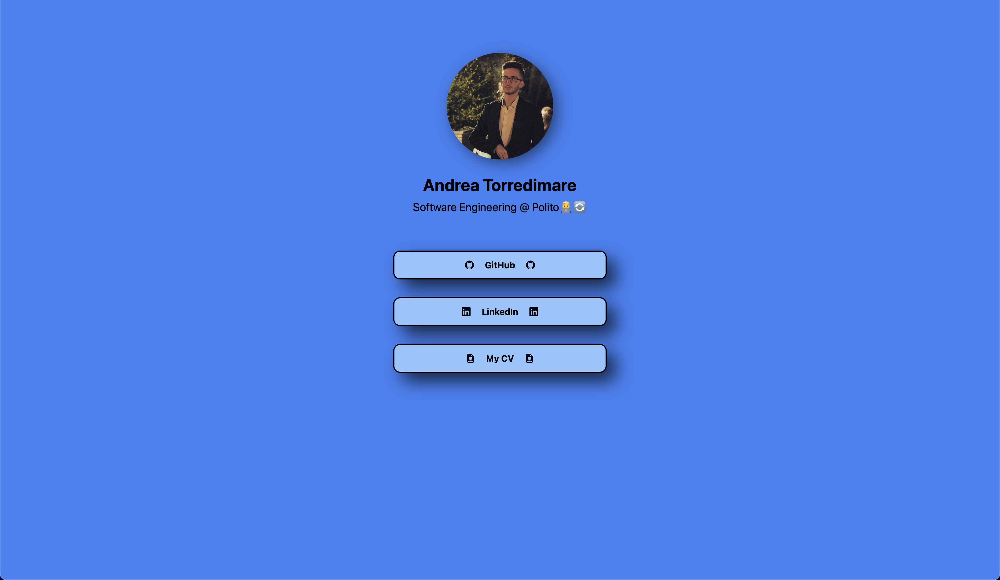

# MyLinktreeClone
This is a very simple Linktree-like page, containing simple links to my GitHub accounts, my LinkedIn profile and a direct download to my CV (which will be updated in time).
It was created using React.js with Vite and it is at the moment hosted on my [test domain](https://www.torretest.uno)

### How does it look?

